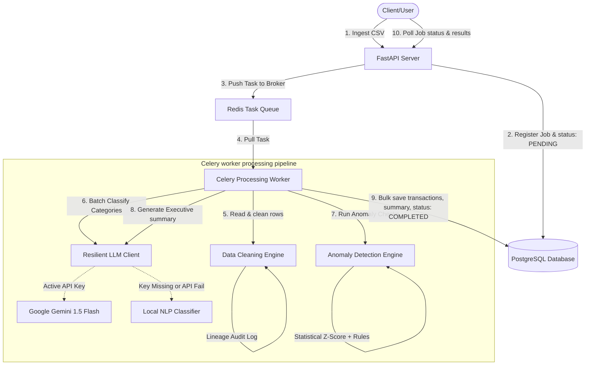

# Almeno Transaction Intelligence Platform

A production-grade, highly scalable financial transaction ingestion, cleaning, and intelligence analysis platform. Built with **FastAPI**, **Postgres**, **Redis**, **Celery**, and **Gemini 1.5 Flash**.

---

## System Architecture

The platform operates on a decoupled async ingestion model to support real-time high-throughput traffic.



---

## Tech Stack & Features

*   **FastAPI backend**: Fully typed, dependency-injected, asynchronous endpoints supporting query filtering and pagination.
*   **Asynchronous Processing**: Celery workers backed by Redis broker. Automatically tracks job progress percentage (`0%` to `100%`) in the database.
*   **Postgres Storage**: SQLAlchemy 2.0 with UUID primary keys, indexed query columns, and JSONB fields for detailed anomaly outputs and lineage logging.
*   **Data Lineage Auditing**: Keeps records of original raw row data, alongside structured modification metadata tracking every correction (e.g. date formatting, casing, currency stripping).
*   **Resilient LLM Integration**: Incorporates an intelligent batching client that bundles categorization requests, implements exponential backoff retries via `tenacity`, and utilizes a **circuit-breaker** that automatically degrades gracefully to a local rule-based NLP classifier if the API fails or if no API key is provided.
*   **Multi-Tier Anomaly Engine**:
    *   *Rule-Based*: Detects domestic merchants charged in USD, and amounts exceeding 3x the account's median transaction value.
    *   *Statistical*: Computes real-time Z-scores per account based on combined historical and active ledger transactions. Detects rapid repeated transactions (same merchant & account within a 10-minute window) and scans transaction notes for forensic keywords.
*   **Observability**: Integrated structured JSON logging via `loguru` with correlated API `Request ID`s and Celery `Task ID`s, alongside Prometheus-compatible metrics (`/metrics`).

---

## Quick Start (Zero Setup)

Prerequisites: [Docker](https://www.docker.com/) and [Docker Compose](https://docs.docker.com/compose/).

1.  **Clone the project** and enter the directory.
2.  *(Optional)* Provide a Gemini API key in the root `.env` file to enable actual AI processing:
    ```env
    GEMINI_API_KEY=your_actual_api_key_here
    ```
    *If left blank, the platform automatically triggers the local fallback NLP model, meaning it still runs to 100% completion.*
3.  **Start the entire stack**:
    ```bash
    docker compose up --build
    ```
    This single command spins up PostgreSQL (initializes tables using Alembic migrations), Redis, the FastAPI API server, and the Celery workers.
4.  **Confirm health & readiness**:
    *   Liveness probe: `http://localhost:8000/api/v1/system/health`
    *   Readiness check: `http://localhost:8000/api/v1/system/readiness` (automatically tests Postgres and Redis connections).

---

## Developer Ergonomics

A `Makefile` is provided in the root directory for ease of development:
*   `make build`: Build the Docker images.
*   `make up`: Spin up all services in the background.
*   `make down`: Shut down all services.
*   `make logs`: Tail logs from all containers.
*   `make test`: Execute the pytest suite.
*   `make clean`: Tear down containers and wipe database volumes.

---

## API Specification & Examples

### 1. Ingest Transaction CSV
Submit a transaction ledger CSV file. The API validates the file limits (default: 10MB, extension: `.csv`), creates a PENDING job record in Postgres, schedules the Celery worker task, and returns immediately.

*   **Endpoint**: `POST /api/v1/jobs/upload`
*   **Request**: `multipart/form-data` with `file=@transactions.csv`
*   **Sample curl**:
    ```bash
    curl -X POST -F "file=@transactions.csv" http://localhost:8000/api/v1/jobs/upload
    ```
*   **Response**:
    ```json
    {
      "job_id": "8b9fdf55-7d52-475f-b529-873b88e16e6d",
      "filename": "transactions.csv",
      "status": "PENDING",
      "message": "Transaction ingestion pipeline queued successfully."
    }
    ```

### 2. Poll Ingestion Job Status
Check the status of the job and monitor its processing percentage.

*   **Endpoint**: `GET /api/v1/jobs/{job_id}/status`
*   **Sample curl**:
    ```bash
    curl http://localhost:8000/api/v1/jobs/8b9fdf55-7d52-475f-b529-873b88e16e6d/status
    ```
*   **Response (Processing)**:
    ```json
    {
      "filename": "transactions.csv",
      "filesize": 6637,
      "id": "8b9fdf55-7d52-475f-b529-873b88e16e6d",
      "status": "PROCESSING",
      "progress": 65,
      "raw_metadata": null,
      "error_summary": null,
      "created_at": "2026-06-09T15:10:00Z",
      "updated_at": "2026-06-09T15:10:15Z"
    }
    ```

### 3. Retrieve Enriched Results & AI Summary
Once status is `COMPLETED` and progress is `100%`, query the results. Supports pagination and filtering by category, account ID, and anomaly flags.

*   **Endpoint**: `GET /api/v1/jobs/{job_id}/results`
*   **Parameters**:
    *   `is_anomaly` (boolean, optional)
    *   `category` (string, optional)
    *   `account_id` (string, optional)
    *   `skip` (int, default: 0)
    *   `limit` (int, default: 100)
*   **Sample curl**:
    ```bash
    curl "http://localhost:8000/api/v1/jobs/8b9fdf55-7d52-475f-b529-873b88e16e6d/results?is_anomaly=true&limit=1"
    ```
*   **Response**:
    ```json
    {
      "job_id": "8b9fdf55-7d52-475f-b529-873b88e16e6d",
      "filename": "transactions.csv",
      "status": "COMPLETED",
      "summary": {
        "id": "c760a955-46aa-4a49-9df8-2b8813bc30f9",
        "job_id": "8b9fdf55-7d52-475f-b529-873b88e16e6d",
        "total_spend": {
          "INR": 1054320.12,
          "USD": 14500.50
        },
        "top_merchants": [
          {
            "merchant": "Flipkart",
            "spend": 146100.68,
            "count": 5
          }
        ],
        "anomaly_count": 12,
        "financial_narrative": "The uploaded batch presents a total volume of 96 transactions. We detected 12 anomalies indicating elevated transaction risks. Spend is predominantly in INR with significant exposure at merchant Flipkart. Operational audit is advised.",
        "risk_level": "MEDIUM",
        "token_usage": {
          "classification": {
            "prompt_tokens": 1240,
            "completion_tokens": 210,
            "fallback_triggered": false
          },
          "summary": {
            "prompt_tokens": 850,
            "completion_tokens": 120,
            "fallback_triggered": false
          }
        },
        "created_at": "2026-06-09T15:10:30Z",
        "updated_at": "2026-06-09T15:10:30Z"
      },
      "transactions": [
        {
          "id": "d0bead44-6cc9-4ba6-9923-cfb88177ca03",
          "job_id": "8b9fdf55-7d52-475f-b529-873b88e16e6d",
          "txn_id": "TXN1009",
          "original_txn_id": "TXN1009",
          "date": "2024-03-11T00:00:00Z",
          "original_date": "11-03-2024",
          "merchant": "MakeMyTrip",
          "original_merchant": "MakeMyTrip",
          "amount": 7428.06,
          "original_amount": "7428.06",
          "currency": "USD",
          "original_currency": "USD",
          "status": "SUCCESS",
          "original_status": "success",
          "category": "Travel",
          "original_category": "Travel",
          "account_id": "ACC004",
          "notes": "SUSPICIOUS",
          "original_notes": "SUSPICIOUS",
          "is_anomaly": true,
          "anomalies": [
            {
              "rule": "DOMESTIC_USD",
              "severity": "HIGH",
              "confidence": 0.9,
              "reason": "Domestic merchant 'MakeMyTrip' charged in USD"
            },
            {
              "rule": "SUSPICIOUS_KEYWORD",
              "severity": "LOW",
              "confidence": 0.7,
              "reason": "Notes contain suspicious keyword(s): suspicious"
            }
          ],
          "cleaning_metadata": {
            "status": {
              "modified": true,
              "original": "success",
              "cleaned": "SUCCESS",
              "reason": "Normalized status casing."
            }
          },
          "created_at": "2026-06-09T15:10:30Z",
          "updated_at": "2026-06-09T15:10:30Z"
        }
      ],
      "pagination": {
        "total": 12,
        "skip": 0,
        "limit": 1
      }
    }
    ```

---

## Design Decisions & Tradeoffs

1.  **Sync vs Async Database Connections**: FastAPI interacts asynchronously via `AsyncSession` to handle hundreds of concurrent request connections efficiently. However, Celery workers run synchronously in a multiprocessing task pool. Spawning event loops inside multi-process tasks is notoriously brittle; hence, we use a separate synchronous `sync_session_maker` connection pool for workers, guaranteeing thread safety.
2.  **Deterministic Fallback NLP**: Financial transactions processing must be deterministic and failure-resilient. A timeout or rate-limit from Gemini should never crash the pipeline. The `ResilientLLMClient` monitors failures (circuit-breaker) and redirects workloads to a local keywords/NLP classifier, ensuring processing is robust and 100% resilient.
3.  **Surrogate Key Generation**: When a ledger row misses its unique identifier (`txn_id`), instead of discarding it, we generate a deterministic SHA-256 hash based on columns (`date`, `amount`, `account_id`) combined with the row index. This preserves the transaction while preventing duplicates.

---

## Scaling Strategy

1.  **Database Partitioning**: The `transactions` table will scale rapidly in production. We can partition it logically by `created_at` or `account_id` to speed up Z-score queries and index sizes.
2.  **Worker Autoscaling**: Celery workers can be scaled out horizontally on Kubernetes or AWS ECS. Since workers are stateless, they pull jobs from Redis independently.
3.  **Statistical Calculation Caching**: Computing account-level medians and standard deviations across millions of database rows is expensive. We can write computed statistics for `account_id` to a Redis caching layer with a short TTL (e.g. 5 minutes) during bulk uploads.
4.  **Database Read Replicas**: Separate transaction retrieval queries (`GET /results`) from worker writes by routing read queries to PostgreSQL read-replicas.
